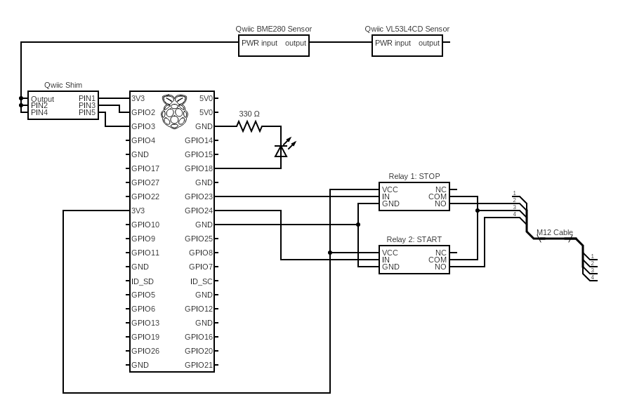

# Auto Paper Feeder Control Code
Code and instructions related to running a mechanical test setup that automatically feeds paper over a long period of time.  The system is powered by Raspberry Pi controlling a motorized paper feeder.

## References
* [General setup and BME280 atmospheric sensor setup](https://learn.sparkfun.com/tutorials/introduction-to-the-raspberry-pi-gpio-and-physical-computing?_gl=1*190akoj*_ga*MTUxODQ3NjE5OC4xNjk5MTI2Njc5*_ga_T369JS7J9N*MTY5OTEzNzUwMS4yLjEuMTY5OTEzODI1MS42MC4wLjA.&_ga=2.259974664.362080396.1699126679-1518476198.1699126679)
* [Qwiic distance sensor library](https://github.com/sparkfun/Qwiic_VL53L1X_Py)
* [Qwiic atmospheric sensor library](https://github.com/sparkfun/Qwiic_BME280_Py)
* [Qwiic thermocouple setup](https://learn.sparkfun.com/tutorials/sparkfun-qwiic-thermocouple-hookup-guide)

## Notes and Troubleshooting

### Hardware notes

Control hardware follows the general structure shown here:


1. Connect Qwiic shim through [Pins 1-6 on RPi 4](https://pinout.xyz/).  Connect the Qwiic connect cable to the shim, and then attach the heatsink (if necessary) over that, since it will block access to the shim.  
2. Connect the sensors.
	* Connect the BME280 atmospheric sensor via the Qwiic cable.  Insert cable on left side.  
	* Connect the VL53L4CD distance sensor via another Qwiic cable, daisy-chaining it from the atmospheric sensor.
	* Connect other sensors as needed in a similar way, if they are different types of sensors.  If you need to connect more sensors of the same type, use an appropriate breakout board.
3. Connect indicator LED through Pin 12 (GPIO 18) and Pin 6 (GND); Pin 12 &rarr; LED+ (long leg) &rarr; 330 ohm resistor &rarr; Pin 6 / ground
4. Connect the relay that will send momentary start/stop signals.  
	* For Relay 1 (STOP signal), connect Pin 17 on the RPi (3.3V) &rarr; VCC on the relay, Pin 16 (GPIO 23) &rarr; IN, and Pin 20 (GND) to GND.
	* For Relay 2 (START signal), connect Pin 17 on the RPi (3.3V) &rarr; VCC on the relay, Pin 18 (GPIO 24) &rarr; IN, and Pin 20 (GND) to GND.
	* In the default setup as of 11/2023, the relays connect to an M12 cable, where the black ground wire connects to the relay COM outputs, the yellow wire connects to the STOP relay NO output (normally open), and the red wire connects to the START relay NO output (normally open).   
5. Set up the paper feeder according to records.  Set it on the slowest speed. Use the `test-relay.py` and `test-cuefeed.py` utilities to help confirm that the paper feeder system and connections are set up properly, as well as the other utilities described in the next section below.
6. The distance sensor must be fixed in place such that it detects the presence of paper remaining in the infeed tray of the device being monitored.


### Installing dependencies and sensor libraries

* Check connections with `i2cdetect -y 1`.

* The `externally-managed-environment` error may come up when installing drivers for the Qwiic sensors.  For example when running: `sudo pip install sparkfun-qwiic-bme280`.  Some [guidance](https://stackoverflow.com/questions/75602063/pip-install-r-requirements-txt-is-failing-this-environment-is-externally-mana/75696359#75696359) led to running a virtual environment:

	```bash
	python3 -m venv .venv
	source .venv/bin/activate
	python3 -m pip install sparkfun-qwiic sparkfun-qwiic-vl53l1x RPi.GPIO python-dotenv
	```

    ...or install a specific library, like: 
	* `python3 -m pip install sparkfun-qwiic-bme280`
	* `python3 -m pip install sparkfun-qwiic-vl53l1x`

* To exit the virtual environment, use the command `deactivate`.

This might work as of 11/5/23... Check `sensor.py` for details.

### Running

* The libraries have to have been installed first as described above, to use the Sparkfun sensors.
* If not already started, start the virtual environment for the Sparkfun sensor libraries: 

	```shell
	source .venv/bin/activate
	```

* Some small Python utilities are available to check the setup in small parts. Run any utility like the following:

	```shell
	python sensor.py
	```
	
    * `sensor.py`: Check if the sensors are reading correctly.
    * `test-cuefeed.py`: Check if paper feeder can feed one sheet out.
    * `test-cuefeed0loop.py`: Check if paper feeder can feed a stack of paper out.
    * `test-distance.py`: Check distance sensor.
    * `test-led.py`: Check LED connections.
    * `test-qwiic.py`: Check Qwiic library availability.
    * `test-relay.py`: Check relay connections.

* Run the long-term testing with paper feeder and sensors integrated.  

	* This following comman runs the default program that also sends alerts to an email if misfeeds or an end of paper stack is detected.  It requires setting up the proper `.env` parameters for email exchange.  (*If using a Gmail address, make sure to set up 2FA, and use an app password.*):

		```shell
		python runPaperStack-alerts.py
		```

	* This runs the program without sending any email alerts:

		```shell
		python runPaperStack-general.py
		```

	
    * Adjust the parameters in the `.env` file as needed.  An example of the parameters needed are in `example.env`.     
	* You may want to set up the screen-blanking or screensaver feature for long-term tests, using `xset s 600` to set the screen timeout to 600 seconds or something similar.
	* Data is saved in a file called `data-paperfeeder.csv` in the repo root directory.  It appends to that file, so make sure to rename, move, and/or delete the files created as needed.

### Remote dev

* You can use [VSCode's remote SSH extension](https://www.raspberrypi.com/news/coding-on-raspberry-pi-remotely-with-visual-studio-code/) to program remotely, if needed.
* Make sure to enable SSH from the RPi settings, and to find the IP address of the RPi, possibly through the router adminstrator.
* You can log into the RPi via the terminal with `ssh [username]@[ipaddress]`

